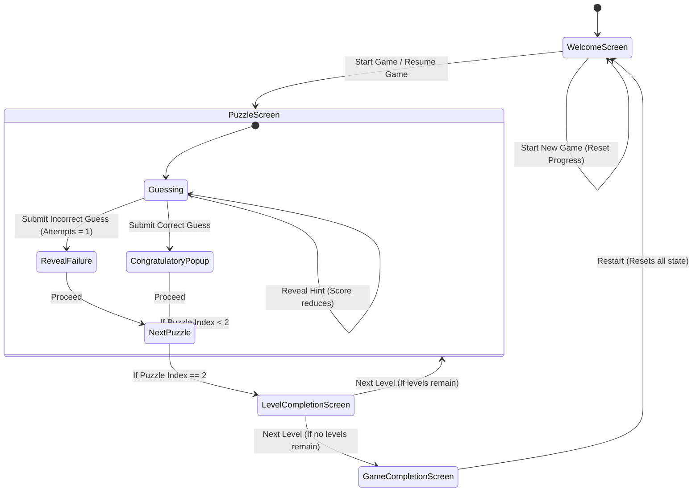

# Data Model: Core Gameplay Foundation

This document defines the entities, attributes, relationships, state transitions, and validation rules for Phase 1.

## Entities & Schemas

### 1. Puzzle (Internal / Predefined Data)
Represents a single word puzzle.
```typescript
interface Puzzle {
  id: string;          // Unique identifier
  question: string;    // The hint/clue presented to the player
  answer: string;      // The correct word/answer
  hints: string[];     // Exactly 3 hints: progressive clues
}
```

### 2. Level (Internal / Predefined Data)
Represents a grouping of puzzles.
```typescript
interface Level {
  levelNumber: number; // 1-indexed level number
  puzzles: Puzzle[];   // Exactly 3 puzzles
}
```

### 3. PlayerState (Persistent Session State)
Represents the current player state stored in local storage.
```typescript
interface PlayerState {
  currentLevelNumber: number;  // 1-indexed current level
  currentPuzzleIndex: number;  // 0-indexed current puzzle in the level (0, 1, 2)
  cumulativeScore: number;     // Total accumulated score across levels
  remainingGuesses: number;    // Guesses remaining for the current puzzle (0-5)
  revealedHintIndices: number[]; // Indices of hints revealed for current puzzle (e.g. [0, 1])
  completedPuzzles: Record<string, { solved: boolean; score: number }>; // Tracks puzzle outcomes
}
```

---

## State Transitions & Actions



### Transition Logic:
1. **Initialize / Load**:
   - On app launch, read serialized `PlayerState` from AsyncStorage under key `@wordquest_player_state`.
   - If not found, initialize default state:
     - `currentLevelNumber`: 1
     - `currentPuzzleIndex`: 0
     - `cumulativeScore`: 0
     - `remainingGuesses`: 5
     - `revealedHintIndices`: []
     - `completedPuzzles`: {}
2. **Submit Guess**:
   - Normalize guess: convert to lowercase, trim leading/trailing whitespace, collapse internal duplicate spaces.
   - If `guess === normalized_answer`:
     - Calculate puzzle score: `100 - (15 * revealedHintIndices.length)`.
     - Update `cumulativeScore` by adding puzzle score.
     - Add entry to `completedPuzzles` with `{ solved: true, score: puzzleScore }`.
     - Transition to `CongratulatoryPopup`.
   - Else:
     - Decrement `remainingGuesses` by 1.
     - If `remainingGuesses === 0`:
       - Add entry to `completedPuzzles` with `{ solved: false, score: 0 }`.
       - Transition to failure reveal.
3. **Reveal Hint**:
   - If `revealedHintIndices.length < 3`:
     - Push next hint index (0, 1, or 2) into `revealedHintIndices`.
     - Deduct 15 from potential puzzle score.
4. **Next Puzzle**:
   - If `currentPuzzleIndex < 2`:
     - Increment `currentPuzzleIndex` by 1.
     - Reset `remainingGuesses` to 5.
     - Reset `revealedHintIndices` to `[]`.
   - Else:
     - Transition to `LevelCompletionScreen`.
5. **Next Level**:
   - If `currentLevelNumber` matches the final predefined level:
     - Transition to `GameCompletionScreen`.
   - Else:
     - Increment `currentLevelNumber` by 1.
     - Reset `currentPuzzleIndex` to 0.
     - Reset `remainingGuesses` to 5.
     - Reset `revealedHintIndices` to `[]`.
6. **Reset Game**:
   - Clear `@wordquest_player_state` from AsyncStorage.
   - Reinitialize state and transition to WelcomeScreen.
