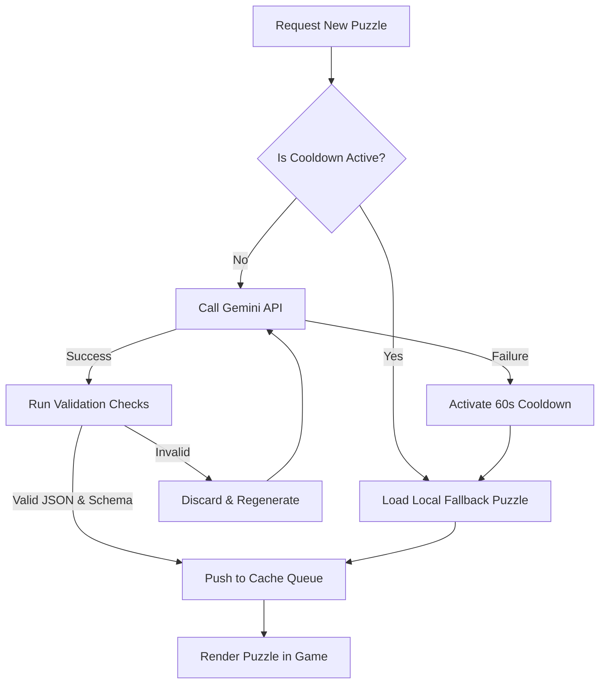

# Data Model: AI Puzzle Generation Engine

## Entities

### 1. GeneratedPuzzle
Represents a single game puzzle dynamically generated by the Gemini API or loaded from the fallback repository.

| Field | Type | Description | Validation Rules |
| :--- | :--- | :--- | :--- |
| `question` | string | The riddle or brain teaser text. | MUST be between 15 and 200 characters long. |
| `answer` | string | The correct solution word. | MUST be a single word, case-insensitive, containing letters only (A-Z, a-z). |
| `hints` | array of strings | Progressive clues. | MUST contain exactly 3 hints. |
| `difficulty` | string | The puzzle difficulty class. | MUST be either `'easy'` or `'medium'`. |

### 2. PuzzleQueueState
Represents the in-memory prefetch queue state.

| Attribute | Type | Description |
| :--- | :--- | :--- |
| `queue` | Array of `GeneratedPuzzle` | Array containing currently cached, validated puzzles. |
| `cooldownUntil` | number | Timestamp (ms) representing when the Gemini API error cooldown expires. |

---

## State Transitions & Validation Flow

