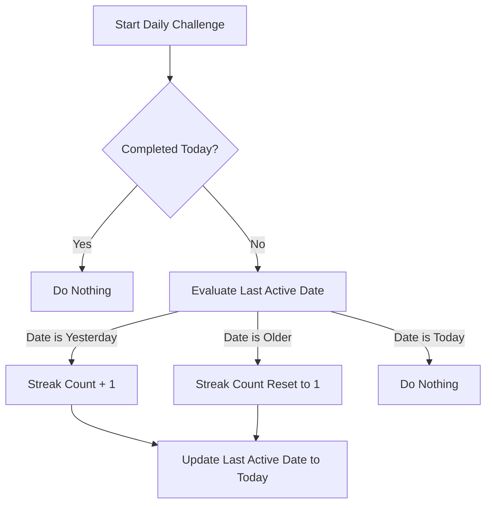

# Data Model: Player Engagement & Progression Systems

## Overview
This document specifies the local data models and schemas stored in AsyncStorage for Phase 3.

---

## 1. Entity Schema Definitions

### 1.1 `PlayerProfile`
Represents the overall player state, saved under key `@wordquest_player_profile`.

```typescript
interface PlayerProfile {
  totalScore: number;         // Cumulative score across all solved puzzles
  xp: number;                 // Cumulative experience points
  level: number;              // Current player level
  rank: string;               // Current player rank title
  levelsCompleted: number;    // Count of unique levels fully completed
  puzzlesSolved: number;      // Count of unique puzzles successfully solved
  guessesSubmitted: number;   // Total count of incorrect + correct guesses
  hintsUsed: number;          // Total count of hints revealed
  streakCount: number;        // Current daily streak count
  lastActiveDate: string | null; // ISO Date YYYY-MM-DD representing last daily challenge completion
  unlockedAchievementIds: string[]; // List of IDs of unlocked achievements
}
```

### 1.2 `Achievement`
Represents a concrete badge/milestone unlocked by the user.

```typescript
interface Achievement {
  id: string;                 // Unique identifier (e.g. 'first-steps')
  name: string;               // Display title
  description: string;        // Criteria details
  unlockedAt: number;         // Epoch timestamp of unlock
}
```

### 1.3 `DailyChallengeState`
Represents daily challenge metadata saved under key `@wordquest_daily_challenge`.

```typescript
interface DailyChallengeState {
  dateString: string;         // ISO Date YYYY-MM-DD
  completed: boolean;         // True if the daily puzzle is solved
  puzzleId: string;           // ID of the daily puzzle generated or fallback
}
```

---

## 2. State Transitions & Rules

### 2.1 XP to Level Calculation
- The `level` is computed deterministically:
  $$\text{Level} = \lfloor \frac{\text{XP}}{500} \rfloor + 1$$
- Rank transitions are triggered on level changes:
  - Level 1-4: `"Novice"`
  - Level 5-9: `"Apprentice"`
  - Level 10-14: `"Journeyman"`
  - Level 15-19: `"Expert"`
  - Level 20+: `"Grandmaster"`

### 2.2 Streak Validation Transition

